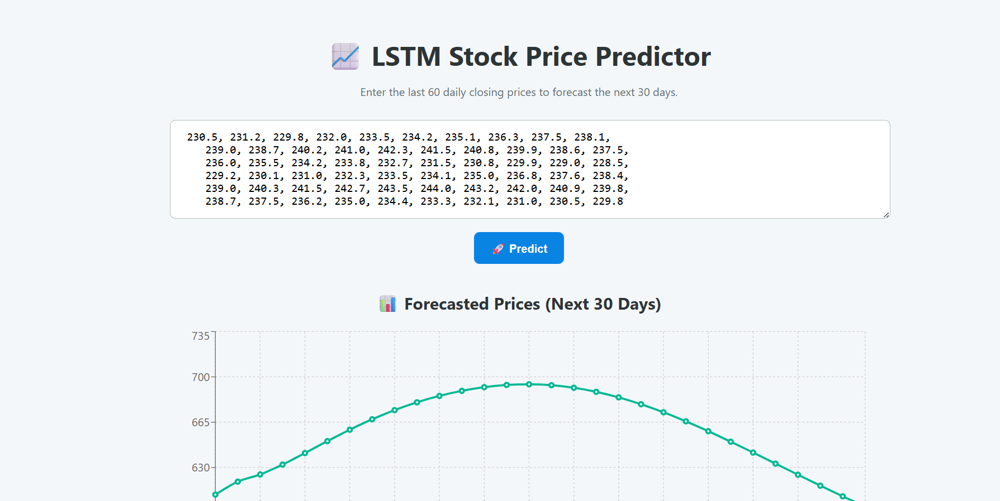
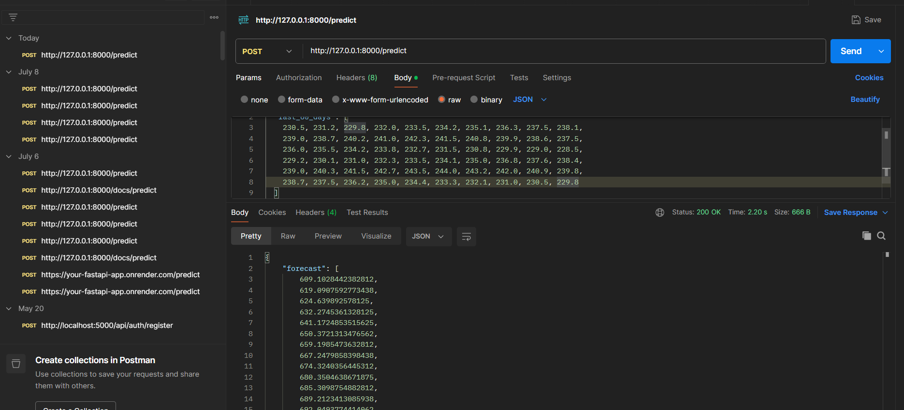

# HCLinternshipproject

# 📈 LSTM Stock Price Predictor

A machine learning-based web application to forecast stock prices for the next 30 days using historical data. It features an LSTM model served via FastAPI and a React frontend for visualization.

---

## 📁 Project Structure

project/
├── frontend/ # React frontend
│ ├── node_modules/
│ ├── public/
│ └── src/
│ └── package.json
│ └── README.md
├── model/ # Trained model files and training notebooks
├── venv/ # Python virtual environment
├── main.py # FastAPI backend
├── requirements.txt # Python dependencies
└── .gitignore # Ignore rules

---

## ⚙️ How to Run the Project

### 🔹 1. Backend Setup (FastAPI)

git clone https://github.com/harshvardhan119/HCLinternshipproject.git
# Create virtual environment (optional)
python -m venv venv
source venv/bin/activate  # On Windows use `venv\Scripts\activate`

# Install dependencies
pip install -r requirements.txt

# Run the FastAPI server
uvicorn main:app --reload
🔹 2. Frontend Setup (React)

cd frontend
npm install
npm start
Then open:
🔗 http://localhost:3000 for the UI
🔗 http://127.0.0.1:8000/docs for the FastAPI Swagger docs

📨 API Endpoint
URL: /predict

Method: POST

Request Body:

json
Copy
Edit
{
  "last_60_days": [230.5, 231.2, 229.8, 232.0, ...]
}
Response:

json
Copy
Edit
{
  "forecast": [609.10, 619.09, 624.63, ...]
}
🧠 Model Used
LSTM (Long Short-Term Memory)

Trained on 5 years of daily stock price data.

Input: last 60 daily closing prices

Output: next 30 days’ predicted closing prices

📸 Screenshots
🔷 Web UI

🔷 Postman API Test

🔧 Tools & Tech Stack
Layer	Tech
Backend	Python, FastAPI, Uvicorn
ML	Keras, TensorFlow, Scikit-learn
Frontend	React.js, Chart.js, Axios
API Test	Postman

✅ Features
Forecast next 30 stock prices using deep learning.

Responsive and clean React-based UI.

FastAPI backend with JSON API.

Graph-based predictions using Chart.js.

📌 Future Improvements
Add live stock scraping from Yahoo Finance API.

Store prediction history in database.

Add login & user-specific tracking.

Add model versioning with MLflow.